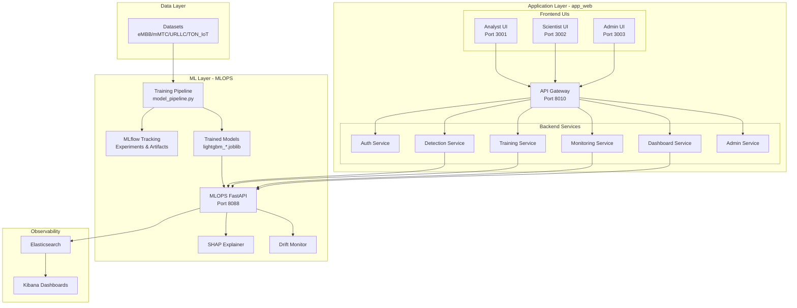
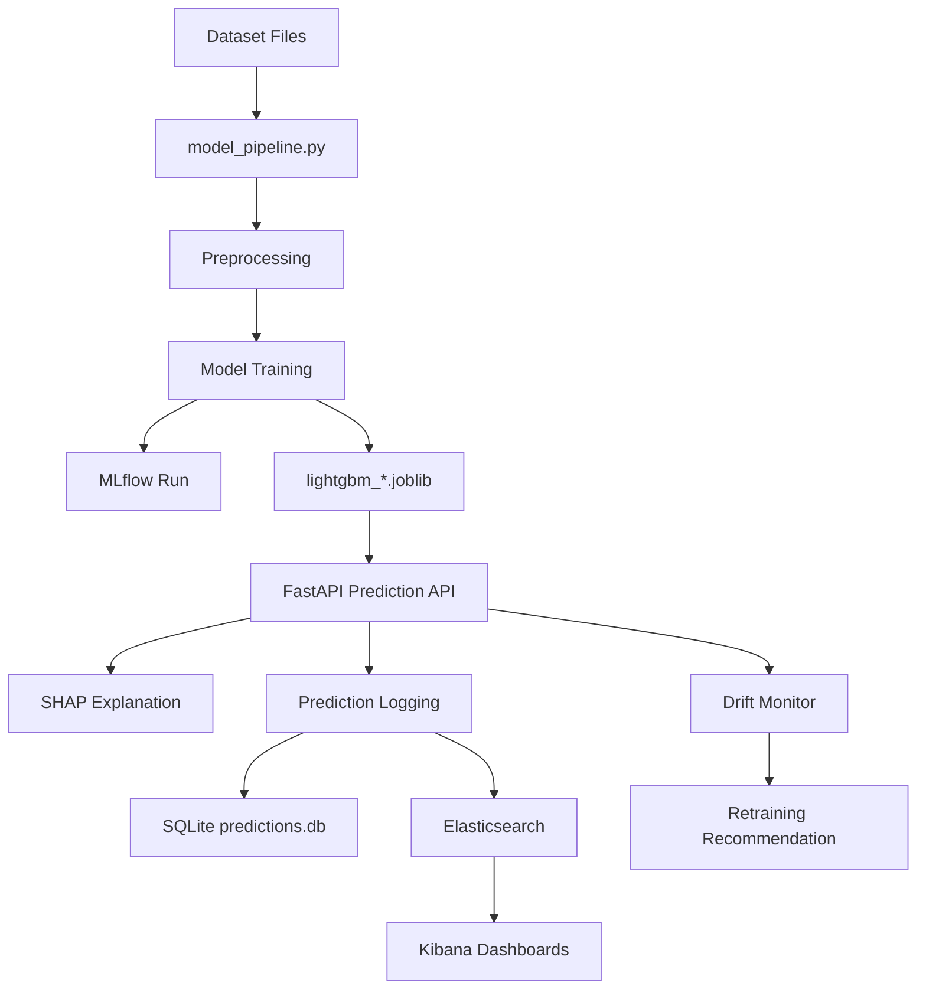
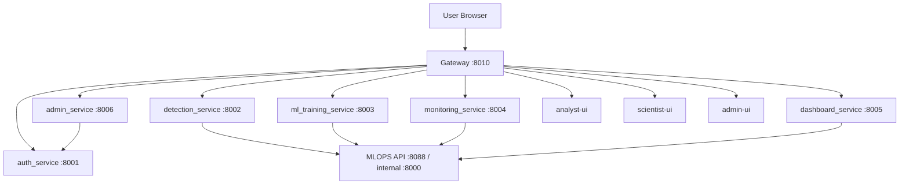
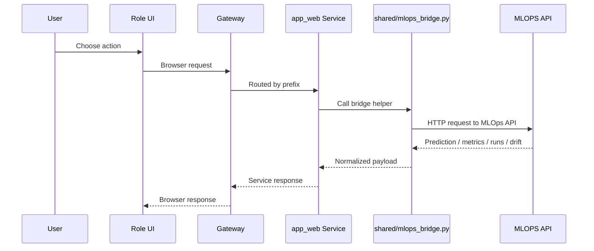

# 🛡️ 6G Smart City IDS Platform

[](https://www.python.org/)
[](https://fastapi.tiangolo.com/)
[](https://reactjs.org/)
[](https://www.docker.com/)
[](https://github.com/features/actions)
[](.)

**Production-ready Intrusion Detection System for 6G Smart City Networks with MLOps, Role-Based Access, and Real-Time Monitoring**

This repository contains a complete enterprise-grade 6G intrusion detection platform with two integrated components:

1. **`MLOPS/`** - ML training, experiment tracking, inference, explainability, drift monitoring, and CI/CD
2. **`app_web/`** - Role-based web platform for Security Analysts, Data Scientists, and Administrators

The platform is designed around real operational workflows:

- ✅ Detect suspicious traffic across 4 network slices
- ✅ Explain predictions with SHAP
- ✅ Monitor model drift and performance
- ✅ Retrain models with MLflow tracking
- ✅ Role-based UIs and APIs
- ✅ Real-time monitoring with ELK stack
- ✅ Automated CI/CD pipeline

## 🚀 Quick Start

### Prerequisites

- **Docker Desktop** (recommended) or Docker Engine + Docker Compose
- **Python 3.11+** (for local development)
- **Node.js 18+** (for frontend development)
- **Git**

### Option 1: Full Stack with Docker (Recommended)

```bash
# Clone the repository
git clone https://github.com/ahmed-karray/Esprit-PI-4DATA-2026-6G-SmartCity-IDS.git
cd Esprit-PI-4DATA-2026-6G-SmartCity-IDS

# Start all services
docker compose up -d --build

# Check service status
docker compose ps

# View logs
docker compose logs -f mlops-api
```

**Access the platform:**

- 🎨 **Analyst UI**: http://localhost:3001
- 🔬 **Scientist UI**: http://localhost:3002
- ⚙️ **Admin UI**: http://localhost:3003
- 🌐 **Gateway**: http://localhost:8010
- 📊 **MLflow UI**: http://localhost:5000
- 🔍 **Kibana**: http://localhost:5601
- 📚 **API Docs**: http://localhost:8088/docs

**Default Login Credentials:**

| Role | Email | Password |
|------|-------|----------|
| Security Analyst | analyst@hexamind.local | analyst123 |
| Data Scientist | scientist@hexamind.local | scientist123 |
| Administrator | admin@hexamind.local | admin123 |

### Option 2: Local Development

See [START_SERVICES.md](START_SERVICES.md) for detailed local development setup.

## 📊 Project Snapshot

### Supported Datasets

This platform targets four IDS datasets representing different 6G network slices:

- **`eMBB`** (Enhanced Mobile Broadband) - High-speed data services
- **`mMTC`** (Massive Machine Type Communications) - IoT device networks
- **`URLLC`** (Ultra-Reliable Low-Latency Communications) - Critical applications
- **`TON_IoT`** - IoT network traffic dataset

### Model Performance

| Dataset | Accuracy | F1 Score | ROC-AUC | Status |
|---------|----------|----------|---------|--------|
| eMBB    | 94.83%   | 94.83%   | 99.26%  | ✅ Excellent |
| mMTC    | 93.07%   | 93.04%   | 98.18%  | ✅ Excellent |
| URLLC   | 75.22%   | 70.84%   | 83.60%  | ⚠️ Good |
| TON_IoT | 99.65%   | 99.51%   | 99.98%  | ✅ Outstanding |

**Average**: 90.69% Accuracy, 89.56% F1 Score

### Attack Types Detected

The system can classify **13 different attack types**:

- DDoS / DoS Attacks
- TCP SYN Flood
- Port Scanning
- Ransomware
- Password Attacks
- Backdoor
- Injection Attacks
- XSS (Cross-Site Scripting)
- MITM (Man-in-the-Middle)
- And more...

### Runtime Stack

```
📦 pi_4data
 ├── mlops-api           (FastAPI + MLflow)
 ├── mlops-elasticsearch (Elasticsearch 8.x)
 ├── mlops-kibana        (Kibana 8.x)
 ├── dev-gateway         (API Gateway)
 ├── dev-auth            (Auth Service)
 ├── dev-detection       (Detection Service)
 ├── dev-training        (ML Training Service)
 ├── dev-monitoring      (Monitoring Service)
 ├── dev-dashboard       (Dashboard Service)
 ├── dev-admin           (Admin Service)
 ├── analyst-ui          (React - Security Analyst)
 ├── scientist-ui        (React - Data Scientist)
 └── admin-ui            (React - Administrator)
```

## 🏗️ Global Architecture



### Key Design Principles

1. **Separation of Concerns**: ML logic (MLOPS) is completely separate from business logic (app_web)
2. **Role-Based Access**: Three distinct UIs with appropriate permissions
3. **Microservices Architecture**: Independent, scalable services
4. **API-First Design**: All functionality exposed via REST APIs
5. **Observability**: Comprehensive logging and monitoring with ELK stack
6. **CI/CD Integration**: Automated testing and deployment pipeline

## ✨ Key Features

### 🤖 Machine Learning & MLOps

- **LightGBM Models**: Fast, accurate gradient boosting for tabular data
- **MLflow Integration**: Complete experiment tracking and model registry
- **SHAP Explainability**: Feature-level explanations for every prediction
- **Drift Monitoring**: Automatic detection of data and performance drift
- **Batch Prediction**: Process multiple samples efficiently
- **Attack Classification**: 13 different attack types with severity levels

### 🔐 Security & Access Control

- **Role-Based Access Control (RBAC)**: Three distinct user roles
- **JWT Authentication**: Secure token-based authentication
- **Cookie-Based Sessions**: Seamless browser experience
- **Password Hashing**: bcrypt for secure password storage
- **API Gateway**: Centralized access control and routing

### 📊 Monitoring & Observability

- **ELK Stack**: Elasticsearch + Kibana for log aggregation
- **Real-Time Metrics**: Live prediction statistics and trends
- **System Health**: Service status and performance monitoring
- **Alert System**: Configurable alerts for drift and anomalies
- **Audit Logging**: Complete prediction history tracking

### 🎨 User Interfaces

#### Security Analyst UI
- Live detection dashboard
- Batch analysis tools
- Prediction history
- Attack distribution charts
- Confidence metrics

#### Data Scientist UI
- Model performance monitoring
- Drift analysis dashboards
- Training job management
- SHAP explanation viewer
- Experiment comparison

#### Administrator UI
- User management
- Access control
- Platform settings
- Service health monitoring
- Complete system overview

### 🚀 DevOps & CI/CD

- **GitHub Actions**: Automated testing and deployment
- **Docker Compose**: One-command stack deployment
- **Health Checks**: Automatic service health monitoring
- **Automated Testing**: 39+ tests with 100% pass rate
- **Code Quality**: Black, Flake8, Bandit, Safety checks

### 📈 Performance

- **API Response Time**: 50-100ms (without SHAP), 150-300ms (with SHAP)
- **Model Training**: 2-5 minutes per dataset
- **Concurrent Users**: Supports multiple simultaneous users
- **Scalability**: Microservices architecture for horizontal scaling

`MLOPS/` is the machine learning backbone of the platform. It owns the model lifecycle and is the source of truth for:

- dataset loading and preprocessing
- training logic
- saved model artifacts
- live prediction
- SHAP explainability
- drift detection
- MLflow experiment tracking
- telemetry logging to Elasticsearch

Key files:

- [MLOPS/app.py](/C:/Users/anasy/Downloads/Esprit-PI-4DATA-2026-6G-SmartCity-IDS-master/Esprit-PI-4DATA-2026-6G-SmartCity-IDS-master/MLOPS/app.py)
- [MLOPS/model_pipeline.py](/C:/Users/anasy/Downloads/Esprit-PI-4DATA-2026-6G-SmartCity-IDS-master/Esprit-PI-4DATA-2026-6G-SmartCity-IDS-master/MLOPS/model_pipeline.py)
- [MLOPS/drift_monitor.py](/C:/Users/anasy/Downloads/Esprit-PI-4DATA-2026-6G-SmartCity-IDS-master/Esprit-PI-4DATA-2026-6G-SmartCity-IDS-master/MLOPS/drift_monitor.py)
- [MLOPS/shap_explainer.py](/C:/Users/anasy/Downloads/Esprit-PI-4DATA-2026-6G-SmartCity-IDS-master/Esprit-PI-4DATA-2026-6G-SmartCity-IDS-master/MLOPS/shap_explainer.py)
- [MLOPS/elk_logger.py](/C:/Users/anasy/Downloads/Esprit-PI-4DATA-2026-6G-SmartCity-IDS-master/Esprit-PI-4DATA-2026-6G-SmartCity-IDS-master/MLOPS/elk_logger.py)
- [MLOPS/database.py](/C:/Users/anasy/Downloads/Esprit-PI-4DATA-2026-6G-SmartCity-IDS-master/Esprit-PI-4DATA-2026-6G-SmartCity-IDS-master/MLOPS/database.py)

### MLOps Flow



### MLOps Responsibilities

#### 1. Training

Training is handled by `model_pipeline.py` and invoked either directly or through the training service bridge.

What happens:

- load the selected dataset
- select the features expected by the model
- preprocess the data
- train the model
- compute evaluation metrics
- save model artifacts
- log run details in MLflow

#### 2. Inference

The main runtime inference endpoint lives in [MLOPS/app.py](/C:/Users/anasy/Downloads/Esprit-PI-4DATA-2026-6G-SmartCity-IDS-master/Esprit-PI-4DATA-2026-6G-SmartCity-IDS-master/MLOPS/app.py).

It handles:

- `POST /predict`
- `POST /predict/batch`
- `POST /explain`
- drift and metrics endpoints

Each prediction can produce:

- prediction label
- confidence
- attack type
- severity
- recommended action
- SHAP explanation

#### 3. Explainability

SHAP is used to explain feature contributions for predictions.

Why it matters:

- makes IDS output auditable
- helps analysts understand why a flow is flagged
- helps scientists compare feature behavior between datasets

#### 4. Monitoring and Drift

The drift subsystem checks whether the distribution or performance of recent traffic differs from what the model was trained on.

It helps answer:

- Is the model still reliable?
- Are feature patterns shifting?
- Should the system recommend retraining?

#### 5. Experiment Tracking

MLflow is used to track:

- training runs
- metrics
- parameters
- artifact outputs

This gives repeatability and makes it easier to compare models over time.

### CI/CD and CM

Here, the practical interpretation is:

- `CI`: automated code quality and testing
- `CD`: automated model pipeline verification and artifact publishing
- `CM`: configuration and container management through Docker, Compose, env files, and workflow definitions

#### CI/CD Workflow

Current GitHub Actions workflow:

- [`.github/workflows/ci.yml`](/C:/Users/anasy/Downloads/Esprit-PI-4DATA-2026-6G-SmartCity-IDS-master/Esprit-PI-4DATA-2026-6G-SmartCity-IDS-master/.github/workflows/ci.yml)

Pipeline stages:

1. `lint-and-format`
2. `security`
3. `unit-tests`
4. `ml-pipeline`

What the pipeline checks:

- formatting with `black`
- linting with `flake8`
- security with `bandit` and `safety`
- Python tests for `MLOPS` and `app_web/backend`
- real training pipeline execution for `eMBB`
- MLflow run creation
- trained artifact upload

#### CM: Configuration and Container Management

Configuration and runtime management are handled through:

- [docker-compose.yml](/C:/Users/anasy/Downloads/Esprit-PI-4DATA-2026-6G-SmartCity-IDS-master/Esprit-PI-4DATA-2026-6G-SmartCity-IDS-master/docker-compose.yml)
- [app_web/backend/.env.example](/C:/Users/anasy/Downloads/Esprit-PI-4DATA-2026-6G-SmartCity-IDS-master/Esprit-PI-4DATA-2026-6G-SmartCity-IDS-master/app_web/backend/.env.example)
- [MLOPS/Dockerfile](/C:/Users/anasy/Downloads/Esprit-PI-4DATA-2026-6G-SmartCity-IDS-master/Esprit-PI-4DATA-2026-6G-SmartCity-IDS-master/MLOPS/Dockerfile)

This is what keeps service URLs, ports, datasets, volumes, and startup behavior consistent.

### MLOps Tools and Why They Were Chosen

| Tool | Role | Why it fits this project |
|---|---|---|
| `FastAPI` | Inference and training-facing API | Fast, typed, easy Swagger docs, good async support |
| `LightGBM` | Main model family in current runtime | Fast training, strong tabular performance, lightweight runtime |
| `MLflow` | Experiment tracking | Tracks runs, metrics, and artifacts without building custom tooling |
| `SHAP` | Explainability | Gives feature-level explanations for IDS decisions |
| `Elasticsearch` | Searchable telemetry store | Good for prediction and drift event indexing |
| `Kibana` | Monitoring UI | Fast way to visualize telemetry and system health |
| `SQLite` | Simple embedded persistence | Easy local/dev setup, zero external DB dependency |
| `Docker` | Packaging | Makes services reproducible across machines |
| `Docker Compose` | Multi-service orchestration | Good fit for a local microservice demo stack |
| `GitHub Actions` | CI/CD automation | Native repo integration and simple workflow setup |

### MLOps Advantages

- end-to-end train-to-serve path in one repository
- explainability built into prediction flow
- drift monitoring connected to the same model layer
- experiment tracking with MLflow
- observability with ELK
- easy local demo through Docker Compose

## Part 2: How app_web Works

`app_web/` is the delivery layer used by people. It does not replace MLOps logic. It wraps it in role-based workflows.

Key areas:

- [app_web/backend/gateway/app.py](/C:/Users/anasy/Downloads/Esprit-PI-4DATA-2026-6G-SmartCity-IDS-master/Esprit-PI-4DATA-2026-6G-SmartCity-IDS-master/app_web/backend/gateway/app.py)
- [app_web/backend/shared/](/C:/Users/anasy/Downloads/Esprit-PI-4DATA-2026-6G-SmartCity-IDS-master/Esprit-PI-4DATA-2026-6G-SmartCity-IDS-master/app_web/backend/shared)
- [app_web/frontend/analyst/src/role.ts](/C:/Users/anasy/Downloads/Esprit-PI-4DATA-2026-6G-SmartCity-IDS-master/Esprit-PI-4DATA-2026-6G-SmartCity-IDS-master/app_web/frontend/analyst/src/role.ts)
- [app_web/frontend/scientist/src/role.ts](/C:/Users/anasy/Downloads/Esprit-PI-4DATA-2026-6G-SmartCity-IDS-master/Esprit-PI-4DATA-2026-6G-SmartCity-IDS-master/app_web/frontend/scientist/src/role.ts)
- [app_web/frontend/admin/src/role.ts](/C:/Users/anasy/Downloads/Esprit-PI-4DATA-2026-6G-SmartCity-IDS-master/Esprit-PI-4DATA-2026-6G-SmartCity-IDS-master/app_web/frontend/admin/src/role.ts)

### app_web Runtime Flow



### Why app_web Exists

The raw MLOps API is good for machines and developers. `app_web` adds:

- authentication
- role separation
- business-safe routes
- role-specific UI workflows
- central gateway entrypoint
- browser-friendly operations

### Backend Services

#### `gateway`

Purpose:

- single browser-facing entrypoint
- forwards `/auth/*`, `/detect/*`, `/train/*`, `/monitor/*`, `/dashboard/*`, `/admin/*`
- proxies the role UIs under one origin

Why this is useful:

- reduces cross-origin complexity
- keeps frontend URLs stable
- centralizes routing

#### `auth_service`

Purpose:

- login
- JWT cookie handling
- profile lookup
- role enforcement support
- user and request management for admin flows

#### `detection_service`

Purpose:

- single prediction
- batch analysis
- explanations
- dataset list for analyst workflows

It delegates ML work to the MLOps API through the shared bridge.

#### `ml_training_service`

Purpose:

- start training jobs
- expose training runs
- expose dataset metadata
- connect scientist/admin workflows to MLOps

#### `monitoring_service`

Purpose:

- model drift
- alerts
- health summaries
- retraining recommendations

#### `dashboard_service`

Purpose:

- role-facing KPIs
- attack distribution
- timeline views
- model summaries

#### `admin_service`

Purpose:

- user and access management
- settings
- platform overview
- admin-only operational actions

### Frontend Roles and Why Each Has Its URL

Each role has its own UI because each role has a different operational job.

#### Analyst

Home URL:

- `http://localhost:8010/analyst/dashboard`

Pages:

- Dashboard
- Live Detection
- Batch Analysis
- Model Comparison
- Swagger

Why this role exists:

- analysts need fast detection workflows
- they should not be exposed to training or user-management controls

#### Data Scientist

Home URL:

- `http://localhost:8010/scientist/monitoring`

Pages:

- Monitoring
- Model Comparison
- Training
- Drift Metrics
- SHAP Explanations
- Swagger

Why this role exists:

- scientists need retraining, explainability, and model health views
- they do not need full admin controls

#### Administrator

Home URL:

- `http://localhost:8010/administrator/dashboard`

Pages:

- Dashboard
- Live Detection
- Batch Analysis
- Model Comparison
- Monitoring
- Training
- Drift Metrics
- SHAP Explanations
- Access Requests
- User Management
- Settings
- Platform
- Swagger

Why this role exists:

- admins supervise the platform, users, and policy controls
- they need cross-cutting visibility across the system

### app_web Tools and Why They Were Chosen

| Tool | Role | Why it fits this project |
|---|---|---|
| `React` | Role UIs | Good for modular dashboards and stateful workflows |
| `FastAPI` | Microservice backend layer | Matches the Python MLOps stack and keeps API typing consistent |
| `httpx` | Gateway and service-to-service communication | Simple async HTTP client for Python services |
| `JWT cookie auth` | Session handling | Works well with gateway-based role routing |
| `SQLAlchemy` | Main app data layer | Easier to evolve than handwritten SQL |
| `SQLite` | Main app DB | Simple bootstrap for local environments |
| `Docker Compose` | Full stack run mode | Keeps the frontend, backend, and MLOps stack aligned |

### app_web Advantages

- role-safe separation of concerns
- central gateway simplifies browser access
- same MLOps core reused by multiple business workflows
- easier demo and presentation for non-technical users
- admin can manage access without touching model code

## How MLOps and app_web Work Together

This is the most important relationship in the repository.

`MLOPS/` does the model work.

`app_web/` makes that model work usable by people.

### Integration Path



### Shared Bridge

The key adapter is:

- [app_web/backend/shared/mlops_bridge.py](/C:/Users/anasy/Downloads/Esprit-PI-4DATA-2026-6G-SmartCity-IDS-master/Esprit-PI-4DATA-2026-6G-SmartCity-IDS-master/app_web/backend/shared/mlops_bridge.py)

It allows `app_web` services to call MLOps endpoints without duplicating model logic.

That design is a big plus because:

- model logic stays centralized
- UI logic stays separate
- role services stay thin
- model changes are easier to propagate

## 🌐 Access URLs

### Platform URLs

| Service | URL | Description |
|---------|-----|-------------|
| **Gateway** | http://localhost:8010 | Main API gateway |
| **MLOPS API** | http://localhost:8088/docs | ML API with Swagger docs |
| **MLflow UI** | http://localhost:5000 | Experiment tracking |
| **Elasticsearch** | http://localhost:9200 | Search & analytics engine |
| **Kibana** | http://localhost:5601 | Visualization dashboards |

### Role-Based UIs

| Role | URL | Description |
|------|-----|-------------|
| **Security Analyst** | http://localhost:3001 | Detection & analysis |
| **Data Scientist** | http://localhost:3002 | Model monitoring & training |
| **Administrator** | http://localhost:3003 | User & platform management |

### Backend Services

| Service | Port | Description |
|---------|------|-------------|
| Auth Service | 8001 | Authentication & user management |
| Detection Service | 8002 | Prediction & analysis |
| Training Service | 8003 | Model training |
| Monitoring Service | 8004 | Drift & alerts |
| Dashboard Service | 8005 | KPIs & metrics |
| Admin Service | 8006 | Platform administration |

## 🐛 Troubleshooting

### Services Won't Start

```bash
# Check if ports are already in use
netstat -ano | findstr :8010
netstat -ano | findstr :8088

# Stop all services and remove volumes
docker compose down -v

# Rebuild from scratch
docker compose up -d --build
```

### "Request failed: /detect/predict" Error

**Cause**: Backend services are not running.

**Solution**: Start all services with Docker Compose (see [START_SERVICES.md](START_SERVICES.md))

### Black Formatting Check Fails

```bash
# Format code automatically
black MLOPS/main.py app_web/backend

# Check formatting
black --check MLOPS/ app_web/backend
```

### Network Download Errors in CI

**Cause**: Temporary network issues during pip install.

**Solution**: The CI workflow now includes automatic retries. Simply re-run the failed workflow.

### Docker Build Fails

```bash
# Clean Docker cache
docker system prune -a

# Rebuild with no cache
docker compose build --no-cache
```

### Can't Access Frontend

1. Check if services are running: `docker compose ps`
2. Check logs: `docker compose logs -f analyst-ui`
3. Verify port 3001/3002/3003 is not in use
4. Try accessing via gateway: http://localhost:8010/analyst/dashboard

### Database Errors

```bash
# Remove and recreate database
docker compose down -v
docker compose up -d --build
```

## 🛠️ Commands & Usage

### Docker Commands

```bash
# Start all services
docker compose up -d --build

# Stop all services
docker compose down

# View logs
docker compose logs -f                    # All services
docker compose logs -f mlops-api          # Specific service
docker compose logs -f dev-gateway

# Check service status
docker compose ps

# Restart specific services
docker compose restart mlops-api detection_service

# Rebuild specific services
docker compose up -d --build mlops-api analyst-ui

# Remove volumes (WARNING: Deletes data)
docker compose down -v
```

### MLOPS Commands

```bash
cd MLOPS

# Training
make train-all          # Train all 4 models
make train              # Train single model
python main.py --dataset eMBB --train

# Services
make api                # Start MLOPS API (port 8088)
make mlflow             # Start MLflow UI (port 5000)
make dashboard          # Start Streamlit dashboard (port 8501)

# Testing
make test               # Run all tests
pytest test_pipeline.py test_api.py test_attack_classifier.py -v

# Monitoring
make monitoring-up      # Start Elasticsearch + Kibana
make monitoring-down    # Stop monitoring stack

# Code Quality
make lint               # Run flake8
make format             # Run black formatter
```

### CI/CD Commands

```bash
# Run CI checks locally
black --check app_web/backend MLOPS
flake8 app_web/backend MLOPS --max-line-length=100
bandit -r app_web/backend MLOPS -ll
pytest MLOPS/ app_web/backend/tests/ -v

# Train model (CI pipeline)
python MLOPS/main.py --dataset eMBB --train
```

### Git Commands

```bash
# Push to master
git add .
git commit -m "feat: your feature description"
git push origin master

# Force push (after rebase)
git push --force-with-lease origin master

# Check status
git status
git log --oneline -10
```

## Storage and Databases

The platform currently uses simple embedded storage in several places:

- main app DB: `app_web/backend/iotinel.db`
- prediction history DB: `MLOPS/predictions.db`
- MLflow tracking DB: `mlflow.db` inside the mounted MLflow volume
- Elasticsearch indices for telemetry and monitoring

This means:

- app users and role-managed data live in the `app_web` database
- prediction telemetry lives in both SQLite and Elasticsearch depending on the function
- experiment tracking lives in MLflow storage

## Why These Tools

The tool choices are practical more than fashionable.

- `FastAPI` was chosen because both MLOps and business services need typed Python APIs quickly.
- `React` was chosen because the platform has multiple role dashboards with dynamic state.
- `LightGBM` was chosen because this project is mainly tabular IDS data, where boosting models are strong.
- `MLflow` was chosen to avoid inventing a custom experiment registry.
- `SHAP` was chosen because security teams need explainable model outputs.
- `Elasticsearch` and `Kibana` were chosen because logs, alerts, and drift signals need searchable monitoring views.
- `Docker Compose` was chosen because the stack is multi-service and easier to demo when launched together.
- `SQLite` was chosen because it lowers setup complexity for development and classroom/demo use.

## 🏗️ Project Structure

```
Esprit-PI-4DATA-2026-6G-SmartCity-IDS/
├── 📁 .github/
│   └── workflows/
│       ├── ci.yml                    # CI/CD pipeline
│       └── cd.yml                    # Deployment workflow
│
├── 📁 MLOPS/                         # Machine Learning Operations
│   ├── app.py                        # FastAPI ML API
│   ├── model_pipeline.py             # Training pipeline
│   ├── main.py                       # CLI interface
│   ├── attack_classifier.py          # Attack type classification
│   ├── shap_explainer.py             # SHAP explanations
│   ├── drift_monitor.py              # Drift detection
│   ├── elk_logger.py                 # Elasticsearch logging
│   ├── database.py                   # SQLite operations
│   ├── dashboard.py                  # Streamlit dashboard
│   ├── lightgbm_*.joblib             # Trained models
│   ├── test_*.py                     # Test suites
│   ├── Dockerfile                    # MLOPS container
│   ├── requirements.txt              # Python dependencies
│   ├── Makefile                      # Build automation
│   └── README.md                     # MLOPS documentation
│
├── 📁 app_web/                       # Web Application
│   ├── 📁 backend/
│   │   ├── gateway/                  # API Gateway
│   │   ├── auth_service/             # Authentication
│   │   ├── detection_service/        # Predictions
│   │   ├── ml_training_service/      # Training jobs
│   │   ├── monitoring_service/       # Drift & alerts
│   │   ├── dashboard_service/        # KPIs & metrics
│   │   ├── admin_service/            # Administration
│   │   ├── shared/                   # Shared utilities
│   │   │   ├── config.py             # Configuration
│   │   │   ├── db.py                 # Database
│   │   │   ├── models.py             # SQLAlchemy models
│   │   │   ├── schemas.py            # Pydantic schemas
│   │   │   ├── security.py           # Auth helpers
│   │   │   └── mlops_bridge.py       # MLOPS integration
│   │   ├── tests/                    # Backend tests
│   │   ├── Dockerfile.backend        # Backend container
│   │   ├── requirements.txt          # Python dependencies
│   │   └── docker-compose.yml        # Services orchestration
│   │
│   ├── 📁 frontend/
│   │   ├── analyst/                  # Security Analyst UI
│   │   │   ├── src/
│   │   │   │   ├── App.tsx           # Main component
│   │   │   │   ├── role.ts           # Role configuration
│   │   │   │   └── index.css         # Styles
│   │   │   ├── Dockerfile            # Frontend container
│   │   │   ├── nginx.conf            # Nginx config
│   │   │   └── package.json          # Dependencies
│   │   ├── scientist/                # Data Scientist UI
│   │   └── admin/                    # Administrator UI
│   │
│   ├── 📁 docs/
│   │   ├── swagger_analyst.yaml      # Analyst API spec
│   │   ├── swagger_scientist.yaml    # Scientist API spec
│   │   └── swagger_admin.yaml        # Admin API spec
│   │
│   └── README.md                     # app_web documentation
│
├── 📁 Data5G/                        # Training datasets
│   ├── eMBB.csv
│   ├── mMTC.csv
│   ├── URLLC.csv
│   └── train_test_network.csv
│
├── 📄 docker-compose.yml             # Full stack orchestration
├── 📄 START_SERVICES.md              # Service startup guide
├── 📄 README.md                      # This file
└── 📄 requirements.txt               # Root dependencies
```

## 🔧 Technology Stack

### Backend Technologies

| Technology | Version | Purpose |
|------------|---------|---------|
| **Python** | 3.11+ | Primary language |
| **FastAPI** | 0.115+ | REST API framework |
| **Uvicorn** | 0.34+ | ASGI server |
| **SQLAlchemy** | 2.0+ | ORM |
| **Pydantic** | 2.11+ | Data validation |
| **LightGBM** | 4.6+ | ML models |
| **MLflow** | 2.22+ | Experiment tracking |
| **SHAP** | 0.47+ | Model explainability |
| **Pandas** | 2.2+ | Data manipulation |
| **NumPy** | 2.2+ | Numerical computing |
| **Scikit-learn** | 1.6+ | ML utilities |

### Frontend Technologies

| Technology | Version | Purpose |
|------------|---------|---------|
| **React** | 18+ | UI framework |
| **TypeScript** | 5+ | Type safety |
| **Vite** | 5+ | Build tool |
| **Tailwind CSS** | 3+ | Styling |
| **Recharts** | 2+ | Data visualization |
| **Swagger UI React** | 5+ | API documentation |

### Infrastructure & DevOps

| Technology | Version | Purpose |
|------------|---------|---------|
| **Docker** | 20+ | Containerization |
| **Docker Compose** | 2+ | Multi-container orchestration |
| **Nginx** | 1.25+ | Web server |
| **Elasticsearch** | 8.13+ | Search & analytics |
| **Kibana** | 8.13+ | Visualization |
| **GitHub Actions** | - | CI/CD |

### Security & Authentication

| Technology | Purpose |
|------------|---------|
| **JWT** | Token-based auth |
| **bcrypt** | Password hashing |
| **python-jose** | JWT handling |
| **passlib** | Password utilities |

### Testing & Quality

| Tool | Purpose |
|------|---------|
| **pytest** | Testing framework |
| **Black** | Code formatting |
| **Flake8** | Linting |
| **Bandit** | Security scanning |
| **Safety** | Dependency scanning |

## 📖 Additional Documentation

For more detailed information, see:

- **[MLOPS/README.md](MLOPS/README.md)** - Complete MLOps pipeline documentation
- **[app_web/README.md](app_web/README.md)** - Web application architecture and services
- **[START_SERVICES.md](START_SERVICES.md)** - Service startup and troubleshooting guide
- **[API_README.md](app_web/API_README.md)** - API documentation and examples

## 🤝 Contributing

This is an educational project for ESPRIT PI 4DATA course. Contributions are welcome!

### Development Workflow

1. Fork the repository
2. Create a feature branch: `git checkout -b feature/your-feature`
3. Make your changes
4. Run tests: `pytest MLOPS/ app_web/backend/tests/ -v`
5. Format code: `black MLOPS/ app_web/backend/`
6. Commit changes: `git commit -m "feat: your feature description"`
7. Push to branch: `git push origin feature/your-feature`
8. Create a Pull Request

### Code Quality Standards

- **Formatting**: Black (line length 100)
- **Linting**: Flake8 (max line length 100)
- **Security**: Bandit (level LL)
- **Dependencies**: Safety check
- **Testing**: pytest with 80%+ coverage

## 📊 Project Statistics

- **Total Lines of Code**: ~15,000+
- **Python Files**: 50+
- **TypeScript Files**: 15+
- **Docker Services**: 13
- **API Endpoints**: 50+
- **Test Cases**: 39+
- **Documentation Pages**: 10+

## 🎓 Educational Context

**Institution**: ESPRIT (École Supérieure Privée d'Ingénierie et de Technologies)  
**Course**: PI 4DATA  
**Year**: 2026  
**Topic**: AI-Driven Attack Defense for IoT Smart City in 6G Networks

### Learning Objectives

- ✅ Machine Learning Operations (MLOps)
- ✅ Microservices Architecture
- ✅ Role-Based Access Control (RBAC)
- ✅ Explainable AI (XAI)
- ✅ Real-Time Monitoring
- ✅ CI/CD Pipelines
- ✅ Docker & Containerization
- ✅ REST API Design
- ✅ Security Best Practices

## 🔒 Security Considerations

### Implemented Security Measures

- ✅ JWT-based authentication
- ✅ Password hashing with bcrypt
- ✅ Role-based access control
- ✅ API gateway for centralized security
- ✅ Input validation with Pydantic
- ✅ SQL injection prevention (SQLAlchemy ORM)
- ✅ CORS configuration
- ✅ Security scanning (Bandit)
- ✅ Dependency vulnerability scanning (Safety)

### Production Recommendations

For production deployment, consider:

- [ ] Use PostgreSQL instead of SQLite
- [ ] Enable HTTPS/TLS
- [ ] Implement rate limiting
- [ ] Add API authentication tokens
- [ ] Enable audit logging
- [ ] Set up monitoring alerts
- [ ] Use secrets management (Vault, AWS Secrets Manager)
- [ ] Implement backup strategy
- [ ] Add DDoS protection
- [ ] Enable container security scanning

## 🚀 Deployment Options

### Local Development (Current)

```bash
docker compose up -d --build
```

### Production Deployment

#### Option 1: Docker Swarm

```bash
docker stack deploy -c docker-compose.yml pi4data
```

#### Option 2: Kubernetes

```bash
# Convert docker-compose to k8s manifests
kompose convert -f docker-compose.yml

# Deploy to cluster
kubectl apply -f .
```

#### Option 3: Cloud Platforms

- **AWS**: ECS, EKS, or Elastic Beanstalk
- **Azure**: AKS or Container Instances
- **GCP**: GKE or Cloud Run

## 📈 Performance Optimization

### Current Performance

- API Response: 50-100ms (without SHAP)
- API Response: 150-300ms (with SHAP)
- Model Training: 2-5 minutes per dataset
- Dashboard Load: 2-3 seconds

### Optimization Strategies

1. **Caching**: Implement Redis for prediction caching
2. **Load Balancing**: Use Nginx or HAProxy
3. **Database**: Migrate to PostgreSQL with connection pooling
4. **Model Serving**: Use TensorFlow Serving or TorchServe
5. **CDN**: Serve static assets via CDN
6. **Horizontal Scaling**: Scale microservices independently

## 🐛 Known Issues & Limitations

### Current Limitations

- SQLite database (not suitable for high concurrency)
- No automated retraining pipeline
- Limited to 4 datasets
- No real-time streaming detection
- Single-node deployment only

### Planned Improvements

- [ ] PostgreSQL migration
- [ ] Automated retraining workflow
- [ ] Real-time streaming with Kafka
- [ ] Multi-model ensemble
- [ ] Advanced drift detection algorithms
- [ ] Natural language explanations (Gemini AI)
- [ ] Mobile application
- [ ] Alert notifications (email, Slack, SMS)

## 📞 Support & Contact

### Getting Help

1. **Documentation**: Check the docs in this repository
2. **Issues**: Open a GitHub issue for bugs or feature requests
3. **Discussions**: Use GitHub Discussions for questions

### Project Team

- **Course**: PI 4DATA
- **Institution**: ESPRIT
- **Year**: 2026

## 📜 License

This project is developed for educational purposes as part of the ESPRIT PI 4DATA course (2026).

## 🙏 Acknowledgments

### Technologies & Frameworks

- **FastAPI** - Modern Python web framework
- **React** - UI library
- **LightGBM** - Gradient boosting framework
- **MLflow** - ML lifecycle management
- **SHAP** - Model explainability
- **Elasticsearch** - Search and analytics
- **Docker** - Containerization platform

### Educational Support

- **ESPRIT** - Educational institution
- **Course Instructors** - Guidance and support
- **Open Source Community** - Tools and libraries

## 🌟 Star History

If you find this project useful, please consider giving it a star ⭐

## 📚 References

### Research Papers

- AI-Driven Attack Defense for IoT Smart City in 6G Networks (included in repository)

### Related Projects

- [MLflow](https://mlflow.org/)
- [SHAP](https://github.com/slundberg/shap)
- [LightGBM](https://lightgbm.readthedocs.io/)
- [FastAPI](https://fastapi.tiangolo.com/)

---

**Version**: 2.0.0  
**Status**: Production-Ready ✅  
**Last Updated**: May 7, 2026

---

<div align="center">

**Made with ❤️ for 6G Smart City Security**

[⬆ Back to Top](#-6g-smart-city-ids-platform)

</div>
