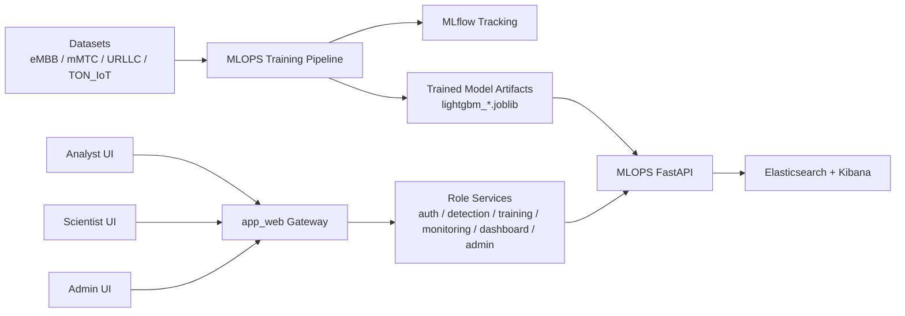
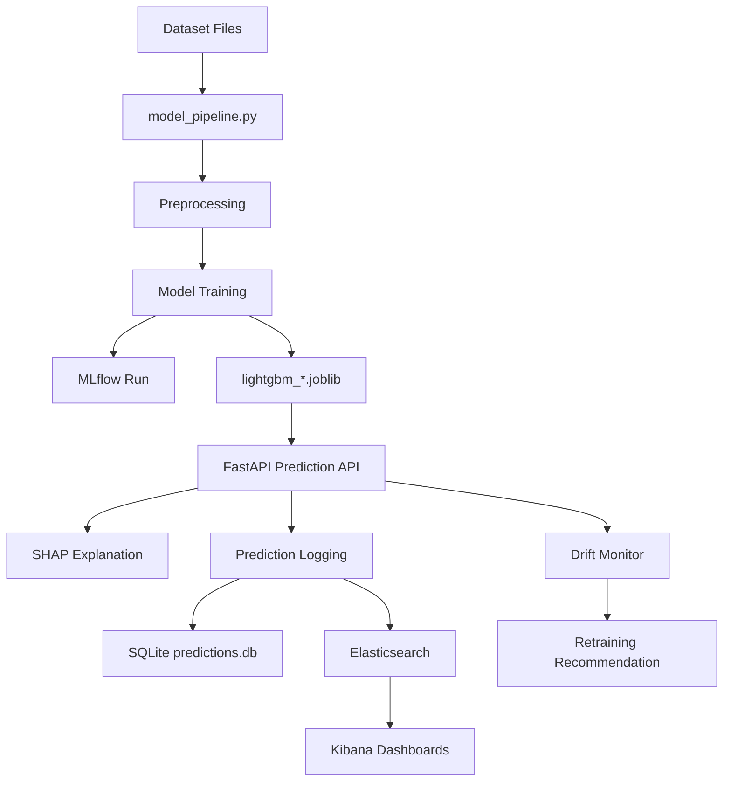
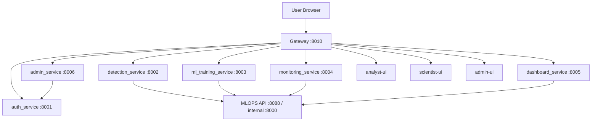
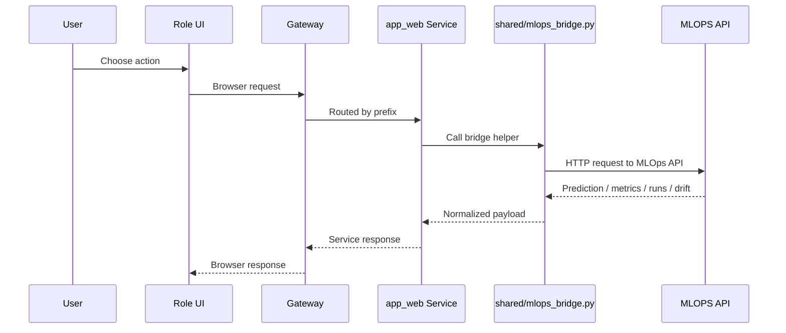

# 6G Smart City IDS Platform

This repository contains a full 6G intrusion detection platform made of two connected parts:

1. `MLOPS/` for model training, experiment tracking, inference, explainability, CI/CD, and monitoring
2. `app_web/` for the role-based web platform used by analysts, data scientists, and administrators

The stack is designed around real operational workflows:

- detect suspicious traffic
- explain predictions
- monitor model drift
- retrain models
- expose role-safe UIs and APIs
- keep experiments, logs, and service health visible

## Table of Contents

- [Project Snapshot](#project-snapshot)
- [Global Architecture](#global-architecture)
- [Part 1: How MLOps Works](#part-1-how-mlops-works)
- [Part 2: How app_web Works](#part-2-how-app_web-works)
- [How MLOps and app_web Work Together](#how-mlops-and-app_web-work-together)
- [URLs](#urls)
- [Commands](#commands)
- [Storage and Databases](#storage-and-databases)
- [Why These Tools](#why-these-tools)
- [Project Structure](#project-structure)

## Project Snapshot

This platform targets four IDS datasets:

- `eMBB`
- `mMTC`
- `URLLC`
- `TON_IoT`

Current runtime stack:

- `mlops-api` for inference, training-facing APIs, SHAP, drift, and MLflow integration
- `mlops-elasticsearch` and `mlops-kibana` for observability
- `dev-gateway` as the browser-facing entrypoint
- `auth_service`, `detection_service`, `ml_training_service`, `monitoring_service`, `dashboard_service`, `admin_service`
- `analyst-ui`, `scientist-ui`, `admin-ui`

Main orchestration file:

- [docker-compose.yml](/C:/Users/anasy/Downloads/Esprit-PI-4DATA-2026-6G-SmartCity-IDS-master/Esprit-PI-4DATA-2026-6G-SmartCity-IDS-master/docker-compose.yml)

## Global Architecture



## Part 1: How MLOps Works

`MLOPS/` is the machine learning backbone of the platform. It owns the model lifecycle and is the source of truth for:

- dataset loading and preprocessing
- training logic
- saved model artifacts
- live prediction
- SHAP explainability
- drift detection
- MLflow experiment tracking
- telemetry logging to Elasticsearch

Key files:

- [MLOPS/app.py](/C:/Users/anasy/Downloads/Esprit-PI-4DATA-2026-6G-SmartCity-IDS-master/Esprit-PI-4DATA-2026-6G-SmartCity-IDS-master/MLOPS/app.py)
- [MLOPS/model_pipeline.py](/C:/Users/anasy/Downloads/Esprit-PI-4DATA-2026-6G-SmartCity-IDS-master/Esprit-PI-4DATA-2026-6G-SmartCity-IDS-master/MLOPS/model_pipeline.py)
- [MLOPS/drift_monitor.py](/C:/Users/anasy/Downloads/Esprit-PI-4DATA-2026-6G-SmartCity-IDS-master/Esprit-PI-4DATA-2026-6G-SmartCity-IDS-master/MLOPS/drift_monitor.py)
- [MLOPS/shap_explainer.py](/C:/Users/anasy/Downloads/Esprit-PI-4DATA-2026-6G-SmartCity-IDS-master/Esprit-PI-4DATA-2026-6G-SmartCity-IDS-master/MLOPS/shap_explainer.py)
- [MLOPS/elk_logger.py](/C:/Users/anasy/Downloads/Esprit-PI-4DATA-2026-6G-SmartCity-IDS-master/Esprit-PI-4DATA-2026-6G-SmartCity-IDS-master/MLOPS/elk_logger.py)
- [MLOPS/database.py](/C:/Users/anasy/Downloads/Esprit-PI-4DATA-2026-6G-SmartCity-IDS-master/Esprit-PI-4DATA-2026-6G-SmartCity-IDS-master/MLOPS/database.py)

### MLOps Flow



### MLOps Responsibilities

#### 1. Training

Training is handled by `model_pipeline.py` and invoked either directly or through the training service bridge.

What happens:

- load the selected dataset
- select the features expected by the model
- preprocess the data
- train the model
- compute evaluation metrics
- save model artifacts
- log run details in MLflow

#### 2. Inference

The main runtime inference endpoint lives in [MLOPS/app.py](/C:/Users/anasy/Downloads/Esprit-PI-4DATA-2026-6G-SmartCity-IDS-master/Esprit-PI-4DATA-2026-6G-SmartCity-IDS-master/MLOPS/app.py).

It handles:

- `POST /predict`
- `POST /predict/batch`
- `POST /explain`
- drift and metrics endpoints

Each prediction can produce:

- prediction label
- confidence
- attack type
- severity
- recommended action
- SHAP explanation

#### 3. Explainability

SHAP is used to explain feature contributions for predictions.

Why it matters:

- makes IDS output auditable
- helps analysts understand why a flow is flagged
- helps scientists compare feature behavior between datasets

#### 4. Monitoring and Drift

The drift subsystem checks whether the distribution or performance of recent traffic differs from what the model was trained on.

It helps answer:

- Is the model still reliable?
- Are feature patterns shifting?
- Should the system recommend retraining?

#### 5. Experiment Tracking

MLflow is used to track:

- training runs
- metrics
- parameters
- artifact outputs

This gives repeatability and makes it easier to compare models over time.

### CI/CD and CM

Here, the practical interpretation is:

- `CI`: automated code quality and testing
- `CD`: automated model pipeline verification and artifact publishing
- `CM`: configuration and container management through Docker, Compose, env files, and workflow definitions

#### CI/CD Workflow

Current GitHub Actions workflow:

- [`.github/workflows/ci.yml`](/C:/Users/anasy/Downloads/Esprit-PI-4DATA-2026-6G-SmartCity-IDS-master/Esprit-PI-4DATA-2026-6G-SmartCity-IDS-master/.github/workflows/ci.yml)

Pipeline stages:

1. `lint-and-format`
2. `security`
3. `unit-tests`
4. `ml-pipeline`

What the pipeline checks:

- formatting with `black`
- linting with `flake8`
- security with `bandit` and `safety`
- Python tests for `MLOPS` and `app_web/backend`
- real training pipeline execution for `eMBB`
- MLflow run creation
- trained artifact upload

#### CM: Configuration and Container Management

Configuration and runtime management are handled through:

- [docker-compose.yml](/C:/Users/anasy/Downloads/Esprit-PI-4DATA-2026-6G-SmartCity-IDS-master/Esprit-PI-4DATA-2026-6G-SmartCity-IDS-master/docker-compose.yml)
- [app_web/backend/.env.example](/C:/Users/anasy/Downloads/Esprit-PI-4DATA-2026-6G-SmartCity-IDS-master/Esprit-PI-4DATA-2026-6G-SmartCity-IDS-master/app_web/backend/.env.example)
- [MLOPS/Dockerfile](/C:/Users/anasy/Downloads/Esprit-PI-4DATA-2026-6G-SmartCity-IDS-master/Esprit-PI-4DATA-2026-6G-SmartCity-IDS-master/MLOPS/Dockerfile)

This is what keeps service URLs, ports, datasets, volumes, and startup behavior consistent.

### MLOps Tools and Why They Were Chosen

| Tool | Role | Why it fits this project |
|---|---|---|
| `FastAPI` | Inference and training-facing API | Fast, typed, easy Swagger docs, good async support |
| `LightGBM` | Main model family in current runtime | Fast training, strong tabular performance, lightweight runtime |
| `MLflow` | Experiment tracking | Tracks runs, metrics, and artifacts without building custom tooling |
| `SHAP` | Explainability | Gives feature-level explanations for IDS decisions |
| `Elasticsearch` | Searchable telemetry store | Good for prediction and drift event indexing |
| `Kibana` | Monitoring UI | Fast way to visualize telemetry and system health |
| `SQLite` | Simple embedded persistence | Easy local/dev setup, zero external DB dependency |
| `Docker` | Packaging | Makes services reproducible across machines |
| `Docker Compose` | Multi-service orchestration | Good fit for a local microservice demo stack |
| `GitHub Actions` | CI/CD automation | Native repo integration and simple workflow setup |

### MLOps Advantages

- end-to-end train-to-serve path in one repository
- explainability built into prediction flow
- drift monitoring connected to the same model layer
- experiment tracking with MLflow
- observability with ELK
- easy local demo through Docker Compose

## Part 2: How app_web Works

`app_web/` is the delivery layer used by people. It does not replace MLOps logic. It wraps it in role-based workflows.

Key areas:

- [app_web/backend/gateway/app.py](/C:/Users/anasy/Downloads/Esprit-PI-4DATA-2026-6G-SmartCity-IDS-master/Esprit-PI-4DATA-2026-6G-SmartCity-IDS-master/app_web/backend/gateway/app.py)
- [app_web/backend/shared/](/C:/Users/anasy/Downloads/Esprit-PI-4DATA-2026-6G-SmartCity-IDS-master/Esprit-PI-4DATA-2026-6G-SmartCity-IDS-master/app_web/backend/shared)
- [app_web/frontend/analyst/src/role.ts](/C:/Users/anasy/Downloads/Esprit-PI-4DATA-2026-6G-SmartCity-IDS-master/Esprit-PI-4DATA-2026-6G-SmartCity-IDS-master/app_web/frontend/analyst/src/role.ts)
- [app_web/frontend/scientist/src/role.ts](/C:/Users/anasy/Downloads/Esprit-PI-4DATA-2026-6G-SmartCity-IDS-master/Esprit-PI-4DATA-2026-6G-SmartCity-IDS-master/app_web/frontend/scientist/src/role.ts)
- [app_web/frontend/admin/src/role.ts](/C:/Users/anasy/Downloads/Esprit-PI-4DATA-2026-6G-SmartCity-IDS-master/Esprit-PI-4DATA-2026-6G-SmartCity-IDS-master/app_web/frontend/admin/src/role.ts)

### app_web Runtime Flow



### Why app_web Exists

The raw MLOps API is good for machines and developers. `app_web` adds:

- authentication
- role separation
- business-safe routes
- role-specific UI workflows
- central gateway entrypoint
- browser-friendly operations

### Backend Services

#### `gateway`

Purpose:

- single browser-facing entrypoint
- forwards `/auth/*`, `/detect/*`, `/train/*`, `/monitor/*`, `/dashboard/*`, `/admin/*`
- proxies the role UIs under one origin

Why this is useful:

- reduces cross-origin complexity
- keeps frontend URLs stable
- centralizes routing

#### `auth_service`

Purpose:

- login
- JWT cookie handling
- profile lookup
- role enforcement support
- user and request management for admin flows

#### `detection_service`

Purpose:

- single prediction
- batch analysis
- explanations
- dataset list for analyst workflows

It delegates ML work to the MLOps API through the shared bridge.

#### `ml_training_service`

Purpose:

- start training jobs
- expose training runs
- expose dataset metadata
- connect scientist/admin workflows to MLOps

#### `monitoring_service`

Purpose:

- model drift
- alerts
- health summaries
- retraining recommendations

#### `dashboard_service`

Purpose:

- role-facing KPIs
- attack distribution
- timeline views
- model summaries

#### `admin_service`

Purpose:

- user and access management
- settings
- platform overview
- admin-only operational actions

### Frontend Roles and Why Each Has Its URL

Each role has its own UI because each role has a different operational job.

#### Analyst

Home URL:

- `http://localhost:8010/analyst/dashboard`

Pages:

- Dashboard
- Live Detection
- Batch Analysis
- Model Comparison
- Swagger

Why this role exists:

- analysts need fast detection workflows
- they should not be exposed to training or user-management controls

#### Data Scientist

Home URL:

- `http://localhost:8010/scientist/monitoring`

Pages:

- Monitoring
- Model Comparison
- Training
- Drift Metrics
- SHAP Explanations
- Swagger

Why this role exists:

- scientists need retraining, explainability, and model health views
- they do not need full admin controls

#### Administrator

Home URL:

- `http://localhost:8010/administrator/dashboard`

Pages:

- Dashboard
- Live Detection
- Batch Analysis
- Model Comparison
- Monitoring
- Training
- Drift Metrics
- SHAP Explanations
- Access Requests
- User Management
- Settings
- Platform
- Swagger

Why this role exists:

- admins supervise the platform, users, and policy controls
- they need cross-cutting visibility across the system

### app_web Tools and Why They Were Chosen

| Tool | Role | Why it fits this project |
|---|---|---|
| `React` | Role UIs | Good for modular dashboards and stateful workflows |
| `FastAPI` | Microservice backend layer | Matches the Python MLOps stack and keeps API typing consistent |
| `httpx` | Gateway and service-to-service communication | Simple async HTTP client for Python services |
| `JWT cookie auth` | Session handling | Works well with gateway-based role routing |
| `SQLAlchemy` | Main app data layer | Easier to evolve than handwritten SQL |
| `SQLite` | Main app DB | Simple bootstrap for local environments |
| `Docker Compose` | Full stack run mode | Keeps the frontend, backend, and MLOps stack aligned |

### app_web Advantages

- role-safe separation of concerns
- central gateway simplifies browser access
- same MLOps core reused by multiple business workflows
- easier demo and presentation for non-technical users
- admin can manage access without touching model code

## How MLOps and app_web Work Together

This is the most important relationship in the repository.

`MLOPS/` does the model work.

`app_web/` makes that model work usable by people.

### Integration Path



### Shared Bridge

The key adapter is:

- [app_web/backend/shared/mlops_bridge.py](/C:/Users/anasy/Downloads/Esprit-PI-4DATA-2026-6G-SmartCity-IDS-master/Esprit-PI-4DATA-2026-6G-SmartCity-IDS-master/app_web/backend/shared/mlops_bridge.py)

It allows `app_web` services to call MLOps endpoints without duplicating model logic.

That design is a big plus because:

- model logic stays centralized
- UI logic stays separate
- role services stay thin
- model changes are easier to propagate

## URLs

### Platform URLs

- Gateway: `http://localhost:8010`
- MLOps FastAPI docs: `http://localhost:8088/docs`
- MLflow UI: `http://localhost:5000`
- Elasticsearch: `http://localhost:9200`
- Kibana: `http://localhost:5601`

### Role URLs

- Analyst: `http://localhost:8010/analyst/dashboard`
- Scientist: `http://localhost:8010/scientist/monitoring`
- Administrator: `http://localhost:8010/administrator/dashboard`

### Service URLs

- Auth service: `http://localhost:8001`
- Detection service: `http://localhost:8002`
- Training service: `http://localhost:8003`
- Monitoring service: `http://localhost:8004`
- Dashboard service: `http://localhost:8005`
- Admin service: `http://localhost:8006`

## Commands

### Full Docker Stack

From the repository root:

```bash
docker compose up -d --build
docker compose down
docker compose logs -f mlops-api
docker compose ps
```

### Rebuild Specific Services

```bash
docker compose up -d --build mlops-api ml_training_service dev-gateway
docker compose up -d --build analyst-ui scientist-ui admin-ui
```

### Restart Without Rebuild

```bash
docker compose restart mlops-api ml_training_service dev-gateway
docker compose restart analyst-ui scientist-ui admin-ui
```

### MLOps Local Commands

```bash
cd MLOPS
make train-all
make api
make mlflow
make monitoring-up
make test
```

### CI/CD Reference

```bash
pytest MLOPS/test_pipeline.py MLOPS/test_api.py MLOPS/test_attack_classifier.py app_web/backend/tests -v --tb=short
python MLOPS/main.py --dataset eMBB --train
```

## Storage and Databases

The platform currently uses simple embedded storage in several places:

- main app DB: `app_web/backend/iotinel.db`
- prediction history DB: `MLOPS/predictions.db`
- MLflow tracking DB: `mlflow.db` inside the mounted MLflow volume
- Elasticsearch indices for telemetry and monitoring

This means:

- app users and role-managed data live in the `app_web` database
- prediction telemetry lives in both SQLite and Elasticsearch depending on the function
- experiment tracking lives in MLflow storage

## Why These Tools

The tool choices are practical more than fashionable.

- `FastAPI` was chosen because both MLOps and business services need typed Python APIs quickly.
- `React` was chosen because the platform has multiple role dashboards with dynamic state.
- `LightGBM` was chosen because this project is mainly tabular IDS data, where boosting models are strong.
- `MLflow` was chosen to avoid inventing a custom experiment registry.
- `SHAP` was chosen because security teams need explainable model outputs.
- `Elasticsearch` and `Kibana` were chosen because logs, alerts, and drift signals need searchable monitoring views.
- `Docker Compose` was chosen because the stack is multi-service and easier to demo when launched together.
- `SQLite` was chosen because it lowers setup complexity for development and classroom/demo use.

## Project Structure

```text
.
├── .github/
│   └── workflows/
│       └── ci.yml
├── MLOPS/
│   ├── app.py
│   ├── model_pipeline.py
│   ├── drift_monitor.py
│   ├── shap_explainer.py
│   ├── elk_logger.py
│   ├── database.py
│   ├── README.md
│   └── Data5G/
├── app_web/
│   ├── backend/
│   │   ├── gateway/
│   │   ├── auth_service/
│   │   ├── detection_service/
│   │   ├── ml_training_service/
│   │   ├── monitoring_service/
│   │   ├── dashboard_service/
│   │   ├── admin_service/
│   │   └── shared/
│   ├── frontend/
│   │   ├── analyst/
│   │   ├── scientist/
│   │   └── admin/
│   └── README.md
├── docker-compose.yml
└── README.md
```

## Extra Notes

- The root README is the platform overview.
- [MLOPS/README.md](/C:/Users/anasy/Downloads/Esprit-PI-4DATA-2026-6G-SmartCity-IDS-master/Esprit-PI-4DATA-2026-6G-SmartCity-IDS-master/MLOPS/README.md) is the deeper MLOps reference.
- [app_web/README.md](/C:/Users/anasy/Downloads/Esprit-PI-4DATA-2026-6G-SmartCity-IDS-master/Esprit-PI-4DATA-2026-6G-SmartCity-IDS-master/app_web/README.md) is the deeper app_web reference.

If you want, the next good step is to split this into:

- `README.md` as the main overview
- `docs/ARCHITECTURE.md`
- `docs/RUNBOOK.md`
- `docs/ROLE_GUIDE.md`

That would make the documentation easier to present and maintain.
